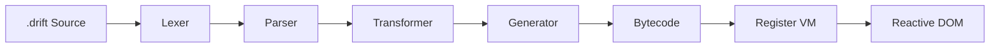

# DriftJS

<p align="center">
  <strong>Register-Based Reactivity for the Web</strong>
</p>

<p align="center">
  A compiler-driven frontend framework built around reactive regions, bytecode, and a register-based virtual machine.
</p>

<p align="center">


</p>

---

## What is DriftJS?

**DriftJS** is a register-based frontend framework designed around a compiler → bytecode → virtual machine architecture.

Instead of treating reactivity as a collection of runtime abstractions, DriftJS compiles `.drift` source into executable instructions that are interpreted by a lightweight client-side runtime.

```text
┌────────────────────┐
│    .drift Source   │
└─────────┬──────────┘
          │
          ▼
┌────────────────────┐
│      Lexer         │
└─────────┬──────────┘
          │
          ▼
┌────────────────────┐
│      Parser        │
└─────────┬──────────┘
          │
          ▼
┌────────────────────┐
│   Transformer      │
└─────────┬──────────┘
          │
          ▼
┌────────────────────┐
│     Generator      │
└─────────┬──────────┘
          │
          ▼
┌────────────────────┐
│      Bytecode      │
└─────────┬──────────┘
          │
          ▼
┌────────────────────┐
│   Register VM      │
└─────────┬──────────┘
          │
          ▼
┌────────────────────┐
│   Reactive DOM     │
└────────────────────┘
```

The goal is simple:

> **Compile declarative UI into efficient executable operations while keeping reactivity explicit and predictable.**

---

# Core Architecture

DriftJS is built around a compiler pipeline and runtime VM.



At a high level:

```text
Source
  ↓
AST
  ↓
Transformation
  ↓
Bytecode
  ↓
Register Instructions
  ↓
Runtime Execution
  ↓
DOM Updates
```

This architecture makes the compiler an important part of the framework rather than simply generating conventional JavaScript templates.

---

# A `.drift` Component

DriftJS uses the `.drift` format for component source.

A simple example:

```drift
<script>
  let user = "Alex";
</script>

<h1>Welcome back, {user}!</h1>
```

The template contains both the component logic and the declarative DOM structure.

Expressions can be embedded directly into markup:

```drift
<h1>Hello, {user}</h1>
```

The compiler transforms these constructs into executable runtime instructions.

---

# Reactivity

Reactive state is compiled into operations that allow the runtime to update affected DOM regions.

Conceptually:

```text
State
  │
  ▼
Reactive Dependency
  │
  ▼
Reactive Region
  │
  ▼
DOM Update
```

Instead of treating the entire component as something that must be re-rendered, DriftJS can work with smaller reactive regions.

```text
┌─────────────────────────────────┐
│          Component              │
│                                 │
│  ┌───────────────────────────┐  │
│  │ Reactive Region           │  │
│  │                           │  │
│  │      { count }            │  │
│  │                           │  │
│  └───────────────────────────┘  │
│                                 │
└─────────────────────────────────┘
```

---

# Register-Based Virtual Machine

One of DriftJS's defining architectural pieces is its **register-based virtual machine**.

The VM operates using registers rather than relying purely on a traditional stack-based execution model.

Conceptually:

```text
┌─────────────────────────────┐
│         REGISTER VM         │
├─────────────────────────────┤
│ r0                          │
│ r1                          │
│ r2                          │
│ r3                          │
│ ...                         │
│ r255                        │
└─────────────────────────────┘
```

The registers provide locations for runtime values and intermediate execution state.

A simplified instruction might conceptually look like:

```text
LOAD    r0, value
ADD     r1, r0, r2
SET     r3, r1
```

The actual instruction set and semantics are defined by the DriftJS implementation.

---

# Bytecode

The compiler produces bytecode that the DriftJS runtime can execute.

The architecture can therefore be represented as:

```text
┌──────────────┐
│ .drift       │
└──────┬───────┘
       │ compile
       ▼
┌──────────────┐
│ Compiler     │
└──────┬───────┘
       │
       ▼
┌──────────────┐
│ Bytecode     │
└──────┬───────┘
       │ execute
       ▼
┌──────────────┐
│ Register VM  │
└──────┬───────┘
       │
       ▼
┌──────────────┐
│ DOM Runtime  │
└──────────────┘
```

This creates a clear separation between:

* source representation
* compilation
* executable instructions
* runtime execution
* DOM manipulation

---

# Instruction Set

DriftJS contains an instruction set used by the runtime VM.

The exact instructions should always be considered implementation-defined.

A conceptual instruction representation looks like:

```text
┌──────────┬────────────┬──────────────────┐
│ Opcode   │ Operands   │ Purpose          │
├──────────┼────────────┼──────────────────┤
│ ...      │ ...        │ ...              │
└──────────┴────────────┴──────────────────┘
```

For the authoritative opcode list and operand definitions, see the project's ISA implementation.

---

# `.drift` Syntax

DriftJS supports template constructs such as expressions and control-flow directives where implemented.

## Expressions

```drift
<h1>{user}</h1>
```

## Attributes

```drift
<div class={className}>
  Content
</div>
```

## Events

```drift
<button onclick={handleClick}>
  Click
</button>
```

## Conditional Rendering

```drift
@if condition
  <p>Condition is true</p>
@else
  <p>Condition is false</p>
```

## Loops

```drift
@for item, index in items
  <div>
    {item}
  </div>
```

## Switch

```drift
@switch value
  @case "one"
    <p>One</p>

  @case "two"
    <p>Two</p>

  @default
    <p>Other</p>
```

> Syntax examples should always correspond to the current implementation. If a construct changes in the compiler, the documentation should change with it.

---

# Reactive Regions

A reactive region represents a portion of the UI whose updates can be associated with reactive state.

```text
State Change
     │
     ▼
Dependency
     │
     ▼
Reactive Region
     │
     ▼
Target DOM
```

This allows the runtime architecture to reason about updates at a more localized level.

---

# DOM Runtime

The runtime connects compiled instructions to actual DOM operations.

```text
Bytecode
   │
   ▼
Register VM
   │
   ├── Create
   ├── Update
   ├── Remove
   ├── Events
   └── Reconcile
          │
          ▼
         DOM
```

The DOM layer is responsible for translating VM execution into browser-visible changes.

---

# Keyed Reconciliation

DriftJS includes keyed reconciliation using an LIS-based approach where implemented.

The conceptual process is:

```text
Old Children
     │
     ▼
Key Matching
     │
     ▼
New Ordering
     │
     ▼
LIS Analysis
     │
     ▼
Minimal DOM Movement
```

This is particularly useful for lists where items are inserted, removed, or reordered.

---

# Compiler Architecture

The compiler can be understood as a series of transformations:

```text
.drift
  │
  ▼
┌─────────────┐
│ DriftLexer  │
└──────┬──────┘
       ▼
┌─────────────┐
│ DriftParser │
└──────┬──────┘
       ▼
┌──────────────────┐
│ DriftTransformer │
└──────┬───────────┘
       ▼
┌────────────────┐
│ DriftGenerator │
└──────┬─────────┘
       ▼
┌────────────────┐
│ CompiledModule │
└────────────────┘
```

Each stage has a specific responsibility in converting source syntax into executable output.

---

# Packages

The repository is organized into packages responsible for different parts of the framework.

```text
packages/
│
├── compiler
├── dom
├── ssr
├── shared
├── vite-plugin
├── cli
└── vscode
```

The exact package structure should follow the current repository implementation.

---

# Development

Clone the repository:

```bash
git clone <repository-url>
cd driftjs
```

Install dependencies:

```bash
npm install
```

Run the development workflow using the project's documented commands.

```bash
npm run dev
```

Build the project:

```bash
npm run build
```

> Use the commands defined by the current `package.json` as the authoritative source.

---

# Project Structure

```text
driftjs/
│
├── packages/
│   ├── compiler/
│   ├── dom/
│   ├── ssr/
│   ├── shared/
│   ├── vite-plugin/
│   ├── cli/
│   └── vscode/
│
├── template/
│
├── examples/
│
├── tests/
│
└── README.md
```

The exact structure may evolve as DriftJS develops.

---

# Documentation

The documentation website is built with **VitePress**.

```text
driftjs-docs/
│
├── package.json
├── package-lock.json
│
└── docs/
    ├── index.md
    │
    ├── .vitepress/
    │   ├── config.ts
    │   └── theme/
    │       ├── index.ts
    │       └── custom.css
    │
    ├── introduction/
    ├── guide/
    ├── concepts/
    ├── syntax/
    ├── architecture/
    ├── packages/
    ├── reference/
    ├── examples/
    └── project/
```

---

# Design Philosophy

DriftJS documentation follows a technical-first philosophy:

```text
Accuracy
   ↓
Clarity
   ↓
Architecture
   ↓
Examples
   ↓
Visual Design
```

The documentation should explain **how DriftJS actually works**, not simply market the framework.

---

# Current Status

DriftJS is an evolving framework.

Features should be considered according to their current implementation status:

```text
┌──────────────────────┐
│     IMPLEMENTED      │
├──────────────────────┤
│ Features available   │
│ in the current code  │
└──────────────────────┘

┌──────────────────────┐
│     EXPERIMENTAL     │
├──────────────────────┤
│ Features still being │
│ actively developed   │
└──────────────────────┘

┌──────────────────────┐
│    UNDER DEVELOPMENT │
├──────────────────────┤
│ Work currently in    │
│ progress             │
└──────────────────────┘
```

DriftJS does not make performance or production-readiness claims without supporting evidence.

---

# Why a Register VM?

The core idea behind DriftJS is to make the execution model explicit.

Instead of thinking only in terms of:

```text
Component
    ↓
Render
    ↓
DOM
```

DriftJS exposes a deeper pipeline:

```text
Component
    ↓
Compiler
    ↓
Bytecode
    ↓
Registers
    ↓
Instructions
    ↓
Runtime
    ↓
DOM
```

This provides a foundation for experimenting with compiler-driven reactivity and runtime execution.

---

# Contributing

Contributions, experiments, bug reports, and architectural discussions are welcome.

Before contributing:

```text
Understand the compiler
        ↓
Understand the runtime
        ↓
Understand the VM
        ↓
Understand the affected package
        ↓
Make the change
        ↓
Test
        ↓
Document
```

Please keep changes focused and consistent with the existing architecture.

---

# License

See the repository's license file for the current licensing terms.

---

# DriftJS

```text
             DRIFTJS

      .drift
         │
         ▼
      Compiler
         │
         ▼
      Bytecode
         │
         ▼
    Register VM
         │
         ▼
    Reactive DOM

  Register-Based Reactivity
          for the Web
```

<p align="center">
  Built around compilation, registers, bytecode, and reactive execution.
</p>
